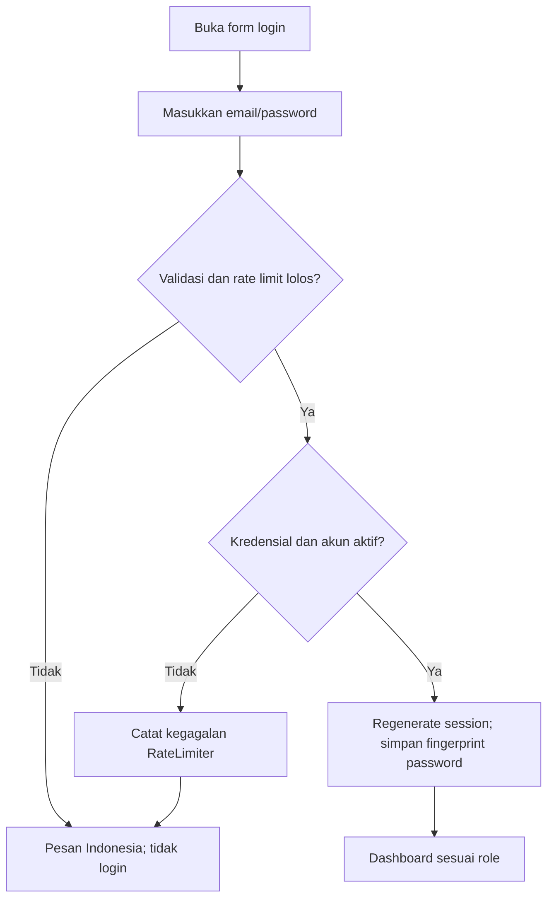
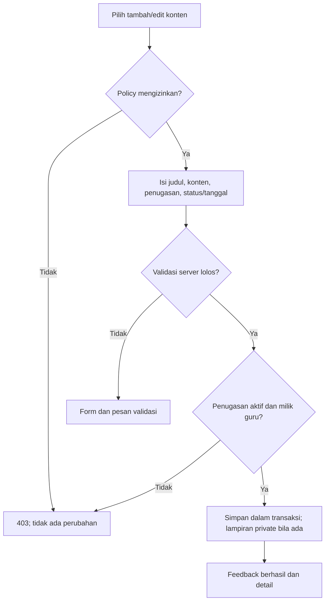
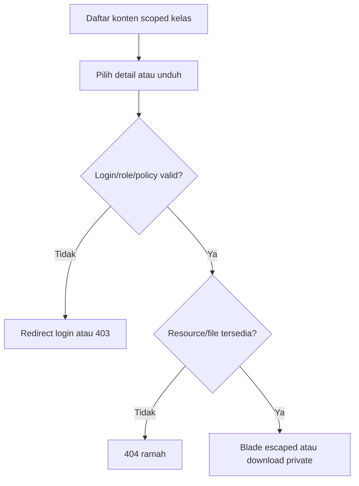

# Dokumentasi Capstone SIPENDAS

Judul: **Rancang Bangun Sistem Informasi Manajemen Pembelajaran Berbasis Web untuk Meningkatkan Efektivitas Pengelolaan Pembelajaran pada Sekolah Dasar**.

Dokumen ini memetakan implementasi yang tersedia untuk BAB III/BAB IV. Ini bukan bukti penelitian lapangan atau peningkatan efektivitas yang sudah diukur. Hasil wawancara, observasi, waktu pengelolaan sebelum/sesudah, dan penilaian pengguna harus berasal dari penelitian nyata, bukan data demo.

## 1. Arsitektur dan lingkungan

Versi terpasang yang diperiksa: Laravel 13.34.0, PHP CLI 8.4.24. Frontend menggunakan Blade, CSS/Tailwind, JavaScript ringan, Poppins, Vite. Target database MySQL melalui .env; automated test memakai SQLite in-memory, tanpa menyentuh database aplikasi. Tidak ada SPA atau project Laravel baru.

Alur aplikasi: browser → route/web middleware → Form Request → controller → policy/service → Eloquent/database → Blade atau file download. Controller menangani HTTP, Form Request memvalidasi, policy memeriksa akses resource, service mengatur transaksi/aturan kompleks, dan model menyediakan relasi/scope. Session authentication memakai satu guard web.

## 2. Entitas dan relationship

Daftar kolom, FK, unique/index, dan ERD tersedia di [database.md](database.md). Sebelas tabel domain: users, academic_years, classrooms, teachers, students, subjects, teaching_assignments, schedules, materials, assignments, learning_information. Tabel bawaan sessions/cache/jobs dan password_reset_tokens adalah infrastruktur, bukan fitur tambahan pengguna.

| Relationship | Kardinalitas | Implementasi |
|---|---|---|
| User–Teacher / User–Student | 1–0..1 | Profil user_id unique; relasi hasOne/belongsTo |
| AcademicYear–Classroom | 1–N | Tahun ajaran memiliki rombel |
| Classroom–Student | 0..1–N | Siswa dapat belum memiliki kelas; satu kelas current |
| Teacher/Classroom/Subject–TeachingAssignment | masing-masing 1–N | Penugasan mengikat guru, kelas, mapel; kombinasi unik |
| TeachingAssignment–Schedule | 1–N | Hari ISO, jam mulai/selesai |
| TeachingAssignment–Material/Assignment/LearningInformation | masing-masing 1–N | Konten memperoleh guru/kelas/mapel dari penugasan |

Nama/email guru dan siswa hanya tersimpan pada users. Tidak ada daftar ID dalam JSON atau kolom tunggal. Master terpakai dilindungi FK restrict; konten soft delete. Riwayat perpindahan kelas, versi kurikulum, dan nilai berada di luar scope.

## 3. Use case per aktor

| Aktor | Use case utama | Batas akses |
|---|---|---|
| Semua | Login, logout, dashboard role | Akun aktif; session dan CSRF |
| Administrator | Kelola akun/profil guru/siswa, tahun ajaran, kelas, mapel, penugasan, jadwal; reset password/nonaktifkan; baca konten | Tidak mengubah konten milik guru lewat endpoint guru |
| Guru | Lihat penugasan/jadwal; buat/edit/arsip materi, tugas, informasi; unduh lampiran | Penugasan aktif miliknya; bukan data guru lain |
| Siswa | Lihat kelas/mapel/jadwal; baca materi/tugas/informasi; unduh lampiran | Kelas sendiri, profil/master aktif, konten published dengan tanggal efektif |

Use case kelola konten mencakup validasi input dan pemeriksaan kepemilikan. Use case unduh mencakup autentikasi dan policy sebelum file dikirim. Tugas hanya untuk dibaca: tidak ada submission, koreksi, nilai, atau rapor. Pengumuman tidak memiliki email/chat/forum.

## 4. Activity flow

### Login



### Guru mengelola konten



### Siswa membuka/unduh konten



## 5. Route dan keamanan

Daftar endpoint aktual: [routes.md](routes.md). Resource administratif menggunakan route administrator.*, guru teacher.*, siswa student.*. Semua mutasi memakai CSRF dan input whitelist. Resource ID diperiksa policy untuk mencegah IDOR; menyembunyikan menu bukan kontrol akses utama.

Ringkasan keamanan: password Hash Laravel min8 huruf+angka saat pembuatan/reset, rate limit lima kegagalan/300 detik per email-IP, session regenerate/logout invalidate, revokasi session saat password berubah pada request berikutnya, HttpOnly/SameSite env-configurable, Eloquent binding, escaped output, private attachment whitelist 5 MB, foreign key/restrict, transaction, dan error nondebug tanpa detail sensitif. Batas kontrol serta checklist infra ada di [security-review.md](security-review.md).

## 6. Setup dan demo pada project existing

Jangan create-project atau migrate:fresh pada database yang berisi data. Isi .env dengan host/port/nama database/akun MySQL milik aplikasi, tanpa mengungkap credential pada laporan atau commit. Pastikan database target benar sebelum migration.

```sh
php artisan config:clear
php artisan migrate:status
php artisan migrate
php artisan db:seed --class=DemoScheduleSeeder
php artisan db:seed --class=DemoMaterialSeeder
php artisan db:seed --class=DemoAssignmentSeeder
php artisan db:seed --class=DemoLearningInformationSeeder
npm run build
php artisan serve
```

Seeder di atas turut menyiapkan master/akun secara idempotent. Pada database demo kosong: 1 admin, 3 guru, 6 siswa, 3 kelas, 3 mapel, 9 penugasan/jadwal, dan masing-masing 18 materi/tugas/informasi (9 terbit, 9 draft). Nilai ini adalah jumlah data dummy, bukan statistik sekolah nyata. File lampiran demo tidak dibuat.

Login awal: administrator@sipendas.example.test, teacher@sipendas.example.test, student@sipendas.example.test; password Demo12345 atau DEMO_PASSWORD yang dikonfigurasi sebelum seed pertama. Seeder tidak mereset password akun existing dan menolak production. Akun tambahan guru1/guru2/siswa1–siswa5 memakai domain yang sama. Tidak ada credential production hardcoded.

Urutan demonstrasi: admin periksa master/penugasan/jadwal → guru buat materi/tugas/informasi → siswa lihat publikasi kelasnya → uji draft/kelas berbeda → unduh lampiran sah → tunjukkan penolakan akses dan validation feedback. Jangan tampilkan .env, password hash, token, atau session ID.

## 7. Pemetaan BAB III dan BAB IV

| Bagian laporan | Materi implementasi/bukti yang diperlukan |
|---|---|
| BAB III: analisis kebutuhan | Tujuan, scope, tiga aktor, matriks fitur; tambahkan hasil observasi nyata |
| BAB III: perancangan | ERD/relationship, use case, activity flow, struktur layer, rancangan keamanan |
| BAB IV: implementasi | Screenshot halaman tiap role, migration/model/request/policy/service dan route terkait |
| BAB IV: pengujian | Matriks black-box dengan hasil aktual dan bukti; automated output terpisah |
| BAB IV: pembahasan | Bandingkan hasil terhadap requirement; bahas keterbatasan dan efek berdasarkan data penelitian |

[black-box-testing.md](black-box-testing.md) adalah rencana manual; jangan mengisi Lulus tanpa pengujian. Jalankan php artisan test --compact untuk automated regression. Bukti visual harus berasal dari aplikasi berjalan, bukan mockup.

## 8. Status dan pekerjaan tersisa

Snapshot terakhir sebelum dokumentasi: 294 automated test lulus, frontend build dan kompilasi Blade berhasil. Periksa ulang output saat menyerahkan karena jumlah test dapat berubah. Implementasi fitur fase 1–9 tersedia; security review dan tambahan test/session revocation sudah dilakukan. UI polish tersedia tetapi verifikasi visual belum selesai.

Belum terbukti: koneksi/migration/end-to-end MySQL aktual, perilaku concurrency/locking MySQL, black-box manual, visual desktop/tablet/mobile, dan konfigurasi production (HTTPS, cookie Secure, APP_DEBUG=false, user DB minimum privilege, backup, jaringan). Ini menghalangi klaim Definition of Done penuh atau siap production, bukan alasan menambah fitur di luar scope.

Dokumentasi modul: [autentikasi](authentication.md), [master data](master-data.md), [jadwal](schedules.md), [materi](materials.md), [tugas](assignments.md), [informasi](learning-information.md), [dashboard](dashboards.md), [UI review](ui-review.md).
