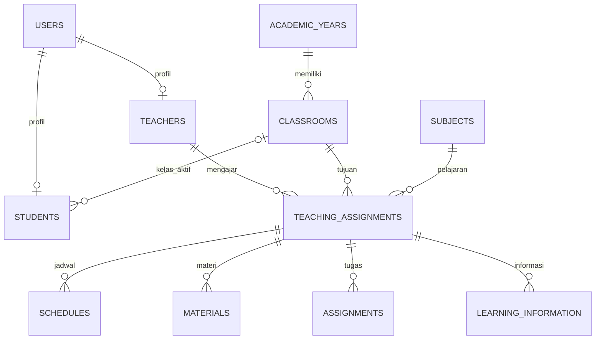

# Database SIPENDAS — Fase 2

Database aplikasi menggunakan MySQL melalui konfigurasi `.env`. Pengujian otomatis menggunakan SQLite in-memory sesuai `phpunit.xml`, sehingga tidak menyentuh data aplikasi. Migration baru bersifat additive; migration dan database SQLite existing tidak dihapus.

## Tabel domain

Semua tabel menggunakan `id` sebagai primary key dan `created_at`/`updated_at` sebagai timestamps. Tabel infrastruktur Laravel seperti sessions, cache, dan jobs tetap digunakan.

| Tabel | Kolom penting | Constraint |
| --- | --- | --- |
| users | name, email, password, role, is_active | email unique; role administrator/teacher/student; index role + is_active |
| academic_years | name, starts_at, ends_at, is_active | name unique, format yang direncanakan YYYY/YYYY |
| classrooms | academic_year_id, name, grade, section, is_active | FK tahun ajaran; unique tahun ajaran + tingkat + bagian |
| teachers | user_id, employee_number, phone, status | user_id unique FK; employee_number nullable unique |
| students | user_id, classroom_id, nis, status | user_id unique FK; NIS unique; FK kelas nullable |
| subjects | code, name, description, is_active | code nullable unique; name unique |
| teaching_assignments | teacher_id, classroom_id, subject_id | seluruh ID FK; kombinasi tiga ID unique |
| schedules | teaching_assignment_id, day_of_week, starts_at, ends_at | FK penugasan; unique penugasan + hari + jam mulai |
| materials | teaching_assignment_id, title, content, status, published_at, metadata lampiran | FK penugasan; soft delete; index penugasan + status + publikasi |
| assignments | teaching_assignment_id, title, description, status, published_at, deadline_at, metadata lampiran | FK penugasan; soft delete; index penugasan + status + publikasi |
| learning_information | teaching_assignment_id, title, content, status, published_at | FK penugasan; soft delete; index penugasan + status + publikasi |

`classrooms.section` menggunakan string kosong untuk kelas tanpa bagian, bukan NULL. Dengan demikian unique constraint tetap mencegah dua kelas tanpa bagian pada tingkat dan tahun ajaran yang sama di MySQL.

Metadata lampiran: `attachment_disk`, `attachment_path`, `attachment_original_name`, `attachment_mime`, dan `attachment_size`. Pada Fase 6/7 upload/download sudah tersedia: PDF/JPEG/PNG maksimum 5 MB, disk learning private, nama acak, dan controller download terotorisasi. Lihat materials.md dan assignments.md.

## ERD



Nama dan email guru/siswa berada di users; tidak disalin ke profil. Guru, kelas, dan mata pelajaran konten diturunkan melalui teaching_assignments. Siswa memiliki satu kelas aktif; riwayat perpindahan kelas berada di luar scope sekarang.

## Integritas dan kewenangan

- Seluruh foreign key domain menggunakan `restrictOnDelete()`; master yang masih direferensikan tidak boleh dihapus permanen.
- Nonaktifkan akun melalui users.is_active. Status profil menggambarkan keadaan guru/siswa; status ini berbeda dari izin login akun.
- UserRole, TeacherStatus, StudentStatus, dan PublicationStatus menggunakan backed enum PHP. Role serta status publikasi juga dibatasi oleh enum schema MySQL.
- Role dan is_active tidak termasuk fillable User. Perubahan akses harus dilakukan secara eksplisit melalui alur administrator terotorisasi pada Fase 3/4.
- Materi, tugas, dan informasi dimulai dengan status draft. Status published dan published_at harus diperiksa saat memberikan akses siswa.
- Penghapusan konten memakai soft delete. Record terhapus masih mereferensikan teaching assignment agar arsip tidak menjadi orphan.
- Teaching assignment yang sudah memiliki jadwal/konten tidak boleh diganti guru, kelas, atau mata pelajarannya secara langsung. Buat assignment baru untuk perubahan tanggung jawab; ini mencegah konten lama berpindah kepemilikan tanpa sengaja.

Fase 4 menerapkan kesesuaian role/profil, aktivasi satu tahun ajaran dalam transaction, grade 1–6, rentang tanggal tahun ajaran, serta larangan membuat penugasan master nonaktif. Lihat `master-data.md`. Fase 5 menerapkan hari ISO 1–7, jam selesai setelah jam mulai, dan pencegahan bentrok kelas/guru; lihat `schedules.md`. Foreign key tidak menggantikan aturan validasi tersebut. Endpoint materi/tugas/informasi pada Fase 6–8 memanggil policy kepemilikan dan scope query daftar. Lihat `authentication.md`.

## Koneksi dan penerapan

`.env.example` sudah menggunakan MySQL dengan nama database contoh `sipendas`. Username dan password sengaja kosong. Isi `.env` lokal sesuai server yang tersedia; jangan commit kredensial. Gunakan akun database aplikasi dengan hak minimum pada production.

Setelah koneksi dikonfigurasi dan database target tersedia:

```sh
php artisan config:clear
php artisan migrate:status
php artisan migrate
```

Jangan menggunakan `migrate:fresh` pada database aplikasi yang memiliki data. Perintah itu hanya tepat pada database pengujian terisolasi.

## Verifikasi Fase 2

`tests/Feature/SchoolSchemaTest.php` menguji relasi akun/profil/kelas/penugasan/konten, keunikan NIS dan profil, keunikan kelas tanpa bagian, keunikan assignment dan slot jadwal, foreign key, larangan penghapusan master terpakai, soft delete, serta perlindungan mass assignment role. Baseline test existing ikut dijalankan.

Pengujian MySQL langsung tetap diperlukan setelah koneksi lokal tersedia. Kelulusan test SQLite tidak membuktikan koneksi ataupun perilaku MySQL sudah diverifikasi.
